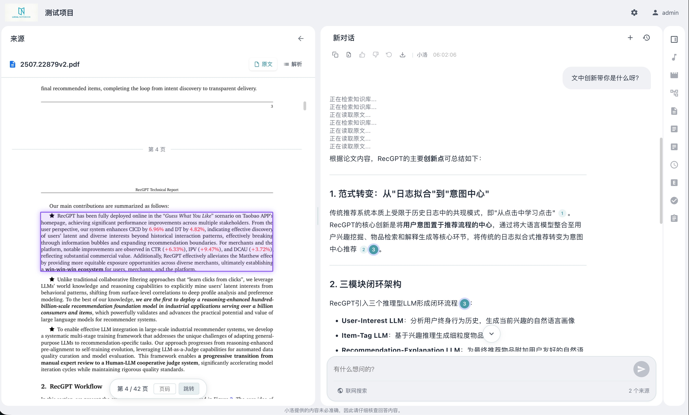
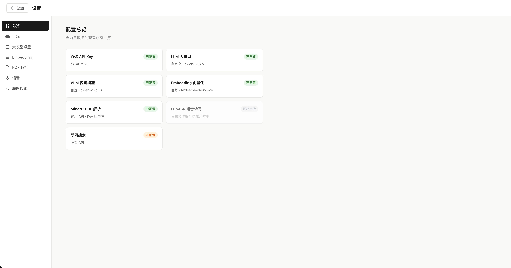

# local-Notebook

> **可完全本地部署的 NotebookLM,专攻非结构化超长文档,代码原生支持多租户扩展。**
>
> 在医疗、法律、金融、合规、科研等无法接受信息错误的场景下,**尤其面对动辄数百页的长文档,LLM 的幻觉与细节丢失**是绕不过的致命问题。local-Notebook 把每一个回答精确链接到原文位置,人工核验只需一次点击 —— 让 AI 输出从"难以判断真伪"变成"可被快速证伪的结论"。且所有数据从不出本机或本网。

## 演示



> 视频演示后续补充。

## 它解决什么问题

NotebookLM 这类产品验证了"以文档为上下文做信息处理"的基本形态,但有两个问题在实际生产力场景无法绕开:

1. **数据必须上传到外部服务** —— 法务合同、隐私数据、内部研报都不可接受
2. **引用粒度太粗** —— 所有一直框架均精确到文档级,人工核验时还要在长文档中长时间翻找具体证据

local-Notebook 围绕这两点重新设计:

- **完全离网部署** —— 后端、前端、向量库、文件存储全本地;LLM 也可配置本地模型(Ollama / vLLM 等兼容接口),从启动到运行不向任何 SaaS 发出一次请求
- **Block 级别精确引用** —— 引用直达原文页码 + 段落(音频为时间戳),"AI 回答 → 证据原文"一键跳转
- **架构面向多租户设计** —— 后端 FastAPI + SQLAlchemy + 任务队列,从"单机单人"到"内网团队/企业租户"无需重写主干（Todo）
- **LLM Provider 无关** —— 兼容任意 OpenAI 协议接口,可全私有化或与商业 API 混用
- **超长文档专项优化** —— 单文档数百页、项目千万字级的长文场景经过深度工程打磨(切块策略、跨段引用追踪、检索排序),细节不丢、上下文不乱

## 项目结构

| 目录 | 职责 | 文档 |
|---|---|---|
| [backend/](./backend) | FastAPI 主服务:API 路由、Agent 对话、引用解析、向量检索、ARQ 后台任务 | [backend/README.md](./backend/README.md) |
| [frontend/](./frontend) | Vue 3 + Vite 前端:项目管理、对话界面、Settings 配置、原文跳转 | [frontend/README.md](./frontend/README.md) |
| [services/](./services) | 可选的本地模型服务(Embedding / MinerU / FunASR),完全离网时启用 | [services/README.md](./services/README.md) |

## 快速开始

前置:Docker Desktop(Mac/Win)或 Docker Engine + Compose(Linux)。

```bash
git clone https://github.com/<your-org>/local-notebook.git
cd local-notebook
./start.sh up --build                          # 首次启动(国内 5-15 min)
./start.sh up                                  # 后续启动
./start.sh down                                # 停止
./start.sh logs -f                             # 查看日志
```

启动后:
- 前端 http://localhost:**8080**
- 后端 API http://localhost:**8081**(如 `curl localhost:8081/health`)
- 局域网内其他机器:本机 IP + 8080

首次进入需[完成配置](#配置) → 进 **Settings** 页填入 LLM `api_key` / `base_url`。不用 Docker 的本地开发方式见 [backend/README.md](./backend/README.md) 与 [frontend/README.md](./frontend/README.md)。

### 首次启动较慢是正常的

第一次 `--build` 大约 10-25 分钟(国内不挂 mirror)。**这是有意的取舍**:本项目为了离线后的稳定性与能力上限,优先选了能完全本地运行的"重"依赖(向量库、文档解析、Agent 框架等),装好之后运行时不再依赖任何外部下载或服务,稳定可控为先。

#### 国内常见问题

国内访问 Docker Hub 与 Debian 官方源都不稳定,build 时容易撞两类问题:

- **镜像拉不下来**(报错通常含 `registry-1.docker.io: Client.Timeout exceeded`)—— 给 Docker Desktop 配一个可用的 registry mirror 即可。可用源经常变化,搜"Docker Hub 国内镜像"找当下能用的列表。
- **build 时 apt / pip 装包很慢**(镜像拉到了但卡在装依赖)—— 用环境变量切国内源,例:
  ```bash
  APT_MIRROR=mirrors.aliyun.com \
  PIP_INDEX_URL=https://mirrors.aliyun.com/pypi/simple \
  ./start.sh up -d --build
  ```
  清华、USTC、腾讯云等任意国内镜像同理。海外用户不设这两个变量即走官方源,仓库本身不绑定区域。

两层都通了仍 timeout,大概率是本地代理(Clash / V2Ray 等)截断了请求。临时关代理或在 Docker Desktop → Settings → Resources → Proxies 选 "No proxy" 排查。

> 额外加速(BuildKit cache mount、预构建镜像推送等)后续补充。

## 配置

启动后到前端 **Settings 页**填入 LLM / Embedding / MinerU / FunASR 配置,实时生效,无需重启。



> 完整配置视频教程后续补充。

**推荐配置路径**:首次部署先用云 API(阿里云百炼 / OpenAI 兼容服务等)快速跑通整套流程,验证体验是否符合预期;之后可在 Settings 页**逐项**切换到 [services/](./services) 下的本地模型服务(Ollama / vLLM / 本地 Embedding / MinerU / FunASR),实现端到端离网。每项配置实时生效、无需停机重启。

> ⚠ **Embedding 是例外**:Embedding 模型不同则向量维度与语义空间不同,**切换 Embedding 后已索引的向量数据全部失效**,需要删除项目重新上传文件并重建索引。建议在首次部署时就**先确定 Embedding 服务**(本地 vs API)再开始批量上传文件。其他组件(LLM / MinerU / FunASR)切换不影响已有数据。

## 数据持久化

所有数据保存在 `LOCAL_NOTEBOOK_DATA_DIR`,默认 `./local-notebook-data/`(启动时自动创建):

```
$LOCAL_NOTEBOOK_DATA_DIR/
├── local_notebook.db          # SQLite (用户/项目/消息/settings,含 API key 明文)
├── local_notebook.db-wal
├── etcd/                      # Milvus 元数据
├── minio/                     # Milvus segment 对象存储
├── milvus/                    # Milvus 状态
└── uploads/                   # 上传的 PDF / 音频
```

自定义路径:
```bash
LOCAL_NOTEBOOK_DATA_DIR=/Users/foo/MyNotebook ./start.sh up
```

**备份**:停止服务后直接 `cp -r` 整个目录即可。

### 重要提示

- **LLM API key 以明文存 SQLite** —— 不要把数据目录推到公开仓库
- **不要指向网络盘** —— NAS / iCloud Drive / OneDrive 同步盘会损坏 SQLite WAL,请用本地物理盘
- **macOS / Windows 性能** —— Docker Desktop bind mount 对大量小文件 IO 有延迟,数千文件时可考虑 named volume
- **生产部署务必覆盖 SECRET_KEY** —— `export SECRET_KEY=$(openssl rand -hex 32)`

## Roadmap

| 阶段 | 主要内容 |
|---|---|
| **v0.1**(当前) | 单机本地部署 + Block 级引用 + 多模态来源面 |
| **v0.2** | **右侧产出面板 + 多模态产出能力** —— 项目页新增右侧产出栏，承载多种富产出形态:Multi-Agent 协作探索(多个专题 Agent 并行讨论同一资料库，跨 Agent 引用)、文生图(基于资料生成示意图 / 流程图 / 海报)、文生视频(自动生成讲解视频)、富文本报告导出 |
| **v0.3** | **进阶 Agent 能力** —— 集成开源生态成熟设计思路:**自动记忆持久化**(对话中沉淀用户偏好与项目上下文)、**Skill 库自迭代**(成功工作流自动沉淀为可复用 skill)、**长期任务规划**(跨会话的复杂任务分解) |
| **v0.4+** | **企业部署优化** —— 多租户隔离、SSO 登录、审计日志、PostgreSQL + Milvus 集群部署模板 |

## 贡献

## License

[Apache License 2.0](./LICENSE)