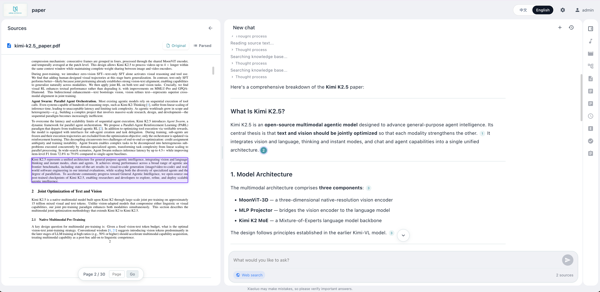
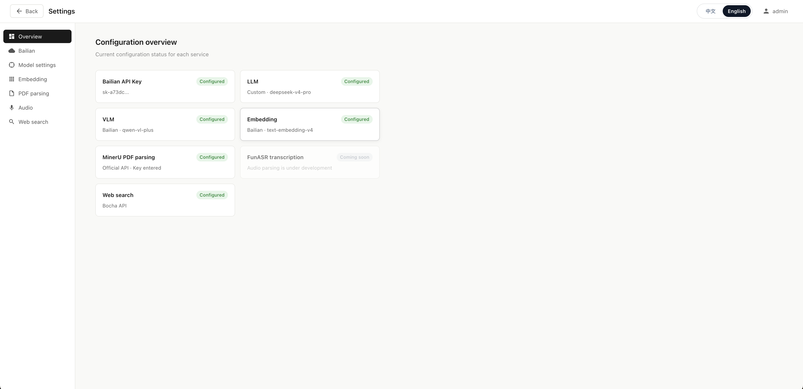

# local-Notebook

[中文](./README.zh.md)

> **A fully local NotebookLM-style application for long, unstructured documents, with a codebase designed for multi-tenant expansion.**
>
> In healthcare, legal, finance, compliance, research, and other high-accuracy workflows, hallucinations and missing details are unacceptable, especially when documents span hundreds of pages. local-Notebook links every answer back to precise source locations so users can verify evidence with one click. Data can stay on the local machine or inside a private network.

## Demo



> Video demo coming later.

## What It Solves

NotebookLM-like products validate the “documents as context” workflow, but two production problems remain:

1. **Data must be uploaded to external services**: contracts, private data, and internal research often cannot leave the organization.
2. **Citations are too coarse**: document-level citations still require manual searching in long files.

local-Notebook is designed around these constraints:

- **Fully offline-capable deployment**: backend, frontend, vector database, and file storage can run locally. LLMs can also use local OpenAI-compatible services such as Ollama or vLLM.
- **Block-level citations**: answers link directly to page and paragraph positions, with timestamp support for audio.
- **Multi-tenant-oriented architecture**: FastAPI, SQLAlchemy, and background workers make it practical to evolve from a single-user local app to an intranet or enterprise deployment.
- **Provider-agnostic LLM integration**: works with OpenAI-compatible APIs, whether private, local, or commercial.
- **Optimized for long documents**: chunking, cross-block citation tracking, and retrieval ranking are tuned for hundreds-of-pages documents and large projects.

## Project Layout

| Directory | Responsibility | Docs |
|---|---|---|
| [backend/](./backend) | FastAPI service: API routes, agent chat, citation parsing, vector retrieval, ARQ tasks | [backend/README.md](./backend/README.md) |
| [frontend/](./frontend) | Vue 3 + Vite app: project management, chat UI, settings, source navigation | [frontend/README.md](./frontend/README.md) |
| [services/](./services) | Optional local model services: Embedding / MinerU / FunASR for offline deployments | [services/README.md](./services/README.md) |

## Quick Start

Prerequisite: Docker Desktop on Mac / Windows, or Docker Engine + Compose on Linux.

```bash
git clone https://github.com/chatboxai/local-notebook.git
cd local-notebook

# First build and start
./start.sh up -d --build

# Later start / logs / stop
./start.sh up -d
./start.sh logs -f
./start.sh down
```

After startup:

- Frontend: [http://localhost:8080](http://localhost:8080)
- Backend API: [http://localhost:8081](http://localhost:8081), for example `curl http://localhost:8081/health`
- Other machines on the LAN: `http://<host-ip>:8080`

On first launch, open **Settings** and configure the LLM `api_key` / `base_url`. For non-Docker local development, see [backend/README.md](./backend/README.md) and [frontend/README.md](./frontend/README.md).

## First Build Can Be Slow

The first `--build` usually takes 10-25 minutes. This is intentional: the project favors dependencies that can run fully locally after installation, including the vector database, document parsing, and agent framework.

## Configuration

Open **Settings** in the frontend to configure LLM / Embedding / MinerU / FunASR. Settings take effect immediately without restarting services.



Recommended path: first use a cloud API such as Alibaba Cloud Bailian or another OpenAI-compatible provider to validate the workflow. Then switch components one by one to local services under [services/](./services), such as Ollama / vLLM / local Embedding / MinerU / FunASR, for end-to-end offline operation.

> **Embedding is the exception**: changing the Embedding model changes vector dimensions and semantic space. Existing indexed vectors become invalid after switching Embedding, so projects must be deleted, files uploaded again, and indexes rebuilt. Choose the Embedding service before bulk uploads.

## Data Persistence

All data is stored in `LOCAL_NOTEBOOK_DATA_DIR`, defaulting to `./local-notebook-data/`:

```text
$LOCAL_NOTEBOOK_DATA_DIR/
├── local_notebook.db
├── local_notebook.db-wal
├── etcd/
├── minio/
├── milvus/
└── uploads/
```

Custom path:

```bash
LOCAL_NOTEBOOK_DATA_DIR=/Users/foo/MyNotebook ./start.sh up
```

Backup: stop services and copy the whole directory with `cp -r`.

## Important Notes

- **LLM API keys are stored in SQLite as plaintext**: never publish the data directory.
- **Do not use a network drive**: NAS / iCloud Drive / OneDrive sync folders may corrupt SQLite WAL files.
- **macOS / Windows performance**: Docker Desktop bind mounts can be slow for many small files; consider a named volume for large workloads.
- **Override `SECRET_KEY` in production**: `export SECRET_KEY=$(openssl rand -hex 32)`.

## Roadmap

| Phase | Scope |
|---|---|
| **v0.1** | Local single-machine deployment, block-level citations, multimodal source panel |
| **v0.2** | Right-side output panel, multimodal outputs, report export, image and video generation |
| **v0.3** | Persistent memory, self-improving skill library, long-running task planning |
| **v0.4+** | Multi-tenant isolation, SSO, audit logs, PostgreSQL + Milvus cluster templates |

## License

[Apache License 2.0](./LICENSE)
